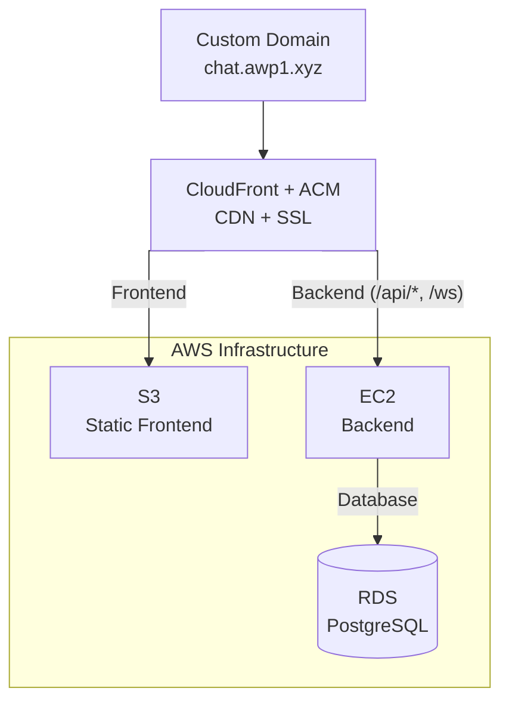

# Simple Live Chat using WebSockets

**justchat** is a *full-stack* real-time chat application built using WebSockets.

Live demo: [chat.awp1.xyz](https://chat.awp1.xyz)

## Features

- Multi-channel chat
- Registered users and guest users
- Persistent message history
- User Presence and member lists
- Typing indicators
- Emoji reactions
- Slash commands (/command)
  - Kick user from channel (`/kick`)
  - Mute user in channel with duration and reason (`/mute` and `/unmute`)
- API endpoints for a dashboard
  - Manage users.
  - Check users messages.
  - Check active channels.
  - Check all members of a channel.

## Local Development

### Frontend

```bash
cd client/web
npm install  
npm run dev  
```

### Backend

```bash
cd server/
cp .env.example .env
docker compose up --build
```

## Backend Structure

```text
server/
├── chat_server/
│   ├── api/                 # REST endpoints and dependencies
│   ├── connection/          # Connection and channel domain models
│   ├── database/            # SQLAlchemy models, repos, DB setup
│   ├── handler/             # WebSocket message handlers and decorators
│   ├── infrastructure/      # Connection manager, broker, registry
│   ├── protocol/            # WebSocket message types
│   ├── schemas/             # Pydantic Schemas
│   ├── security/            # JWT and password helpers
│   ├── services/            # Application/business logic
│   ├── main.py              # entrypoint
│   └── settings.py          # Settings
├── alembic/                 # Database migrations
├── tests/                   # Repository and service tests
├── Dockerfile
└── compose.yml
```

## Deployment

<div align="center">



</div>

### Security

- S3 bucket is private -- accessible only via CloudFront Origin Access Control
- EC2 security group allows inbound traffic only from CloudFront
- All traffic encrypted via HTTPS/WSS (ACM certificates)
- Database in private subnet, accessible only from EC2

## Message Protocol

The chat communication is done entirely in WebSockets.

### Creating new protocols

Easily creating new protocols was a top priority in the design

1. Create a new `MessageType` Enum in `server/protocol/enums.py` that will be used
to identify this protocol.
2. Create the **Payload Body** in `server/protocol/messages.py` that will
contain all the data that is needed for this protocol to work. What is
sent/received by both the client and server.
3. Create a `handler` for your protocol inside `server/handler/` that will contain
your **implementation** of the protocol or will call a service that will handle
the implementation.
4. And **register** this `handler` to a `MessageType` inside `server/handler/routes.py`

After this, all incoming WebSockets messages of `MessageType` will be routed to
the new `handler`.

#### Dependency Injections

I have implemented decorators (`server/handler/decorators.py`) to act as
middleware for common message restrictions, e.g. checking if the user is
currently in the channel or if the user is muted.

This allows for validation to occur even before the protocol
implementation executes.

- `@require_channel`: Ensure the requested channel exists.
- `@require_membership`: Ensure user is a member of the channel.
- `@require_permission(permission)`: Ensure user has the required `permission`.
- `@require_not_muted`: Ensure user is not muted.

### Protocols Format

Every message protocol (`protocol/messages.py`) is a child of the `BaseMessage`
(`protocol/basemessage`), which represents the protocol in its base form.

Every message contains a `payload` that will hold the data needed for certain
messages, e.g. a `CHAT_SEND` message will handle every message sent by
a user. It expects the sender's `username`, the `channel_id` and the `content`
of the message, while a `CHANNEL_JOIN` expects the `channel_id` and
an User (that is filled by the server).

That means both messages are `BaseMessage`, however their `payload` will be
their differences.

#### Validation of the Message Protocol

Validation is done *automatically* by **Pydantic** since `BaseMessage`
is created using Pydantic's `BaseModel`.
